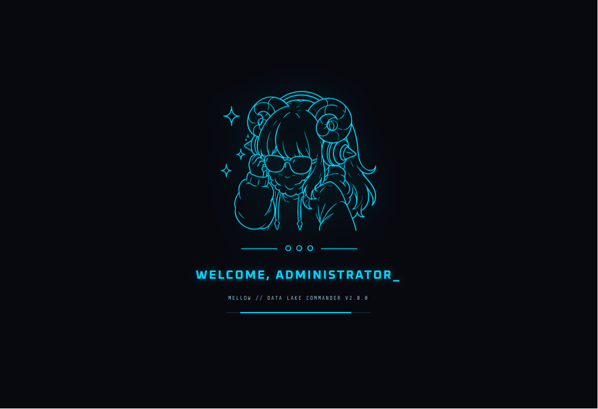

<div align="center">


# MellowDLP

Personal desktop GUI for [yt-dlp](https://github.com/yt-dlp/yt-dlp). Download audio and video from YouTube, SoundCloud, and anything yt-dlp supports.

> Personal project, not designed to be maintained for others.

</div>

---

## Preview

<div align="center">



</div>

---

## Features

- **Feed**: paste a URL, analyze it, pick format/quality, download. Supports videos, playlists, audio-only (with a bitrate choice), and multi-URL batch jobs. Paste (Ctrl+V) or drop a link anywhere in the window to analyze it. Tells you when you already downloaded a video, with a shortcut to the file.
- **Plain-language errors**: common failures (outdated yt-dlp, bot checks, private or removed videos, geo-blocks, network, full disk) are explained with the fix, often as a one-click button.
- **Queue**: download jobs with live progress (speed, ETA, per-item thumbnails). Pause, resume, reorder, or cancel; run up to 3 at once (`download_workers`, default 1).
- **Vault**: browse your local media library by folder. Thumbnail previews, file stats, direct media player launch.
- **Library sync**: link a vault folder to a playlist URL. Add-only or mirror mode (deletes local files no longer in the playlist).
- **Archive file**: `mellow_archive.txt` per folder tracks downloaded URLs so yt-dlp skips duplicates. Auto-updated on download, sync, and delete. Import in Feed to reproduce the same library on another device.
- **Analytics**: download history with stats by platform, format, and uploader. CSV export and custom SQL.
- **Cookies**: pull cookies from your browser for age-restricted content.
- **Network**: proxy, rate limit, and a Force IPv4 switch for connections where IPv6 hangs.
- **Notifications**: optional desktop notification when a download finishes or fails in the background.
- **yt-dlp self-update**: update yt-dlp from the Config page when running from source (takes effect after a restart). The packaged `.exe` can't replace its bundled copy — see Limitations.

Video: MP4, MKV, WebM at best, 4K, 1080p, 720p, 480p or 360p. Audio: MP3, M4A, AAC, Opus (best, 320, 256, 192 or 128 kbps), FLAC, WAV.

---

## Stack

| Layer | Tech |
|---|---|
| Backend | Python 3.12+, Flask, yt-dlp |
| Frontend | React (UMD, no npm), esbuild |
| Desktop window | FlaskWebGUI (Tkinter) |

---

## Requirements

- Python 3.12+ (flaskwebgui uses 3.12-only syntax)
- [ffmpeg](https://ffmpeg.org/) — see below, it is not optional in practice
- Node.js + esbuild (build step only)
- **Linux:** `python3-tk` (`sudo apt install python3-tk`)

### ffmpeg

ffmpeg does the merging, converting, trimming and embedding. It is **not bundled**; install it once:

| OS | Command |
|---|---|
| Windows | `winget install Gyan.FFmpeg` |
| macOS | `brew install ffmpeg` |
| Linux | `sudo apt install ffmpeg` |

MellowDLP looks on `PATH`, next to the app (`ffmpeg/`), and in the usual winget / Chocolatey / Scoop / Homebrew folders, so a fresh install is picked up without restarting. For any other location set `"ffmpeg_location"` in `~/.mellow_dlp.json` to the binary or its folder. The status bar shows whether it was found.

Without ffmpeg the app still runs, with limits it tells you about: audio is saved in its original format (usually `.m4a`) instead of being converted, and sites that serve video and audio as separate streams (YouTube) cannot be saved as video at all.

---

## Installation

**Windows** — download the `.exe` installer from Releases, then install ffmpeg (above).

**Linux:**
```bash
git clone https://github.com/jenox645/Mellow
cd Mellow
bash setup.sh
./dist/MellowDLP
```

Or build a `.deb` package:
```bash
python3 build_linux_deb.py
sudo dpkg -i dist/mellowdlp_*.deb
```

---

## Build from source

```bash
pip install -r requirements.txt pyinstaller pillow
npm install -g esbuild
python3 build_setup.py
```

Rebuild frontend only (after editing anything under `gui/`):
```bash
python build_setup.py --frontend-only
```

Run without building a binary (`static/` is build output, so build the frontend once first):
```bash
python build_setup.py --frontend-only
python3 main.py
```

---

## Tests

```bash
pip install -r requirements.txt -r requirements-dev.txt
python -m pytest tests/ -m "not e2e and not slow"
ruff check .
```

Tests never touch your real config, database or queue — every test runs against a temp folder. The `e2e` and `slow` markers download from real sites and are run by hand.

`python scripts/canary.py` checks that extraction still works against live sites; CI runs it weekly on the yt-dlp pre-release.

---

## Limitations

- ffmpeg must be installed separately (see Requirements).
- No auto-update for MellowDLP itself — pull and rebuild manually.
- Desktop window uses Tkinter via FlaskWebGUI, not a real browser engine.
- yt-dlp breaks whenever platforms change their APIs (a copy a few months old gets `HTTP Error 403` on most YouTube downloads). From source, update it on the Config page or with `pip install -U yt-dlp` and restart. The packaged `.exe` freezes yt-dlp at build time, so it needs a rebuild to get a newer one.
